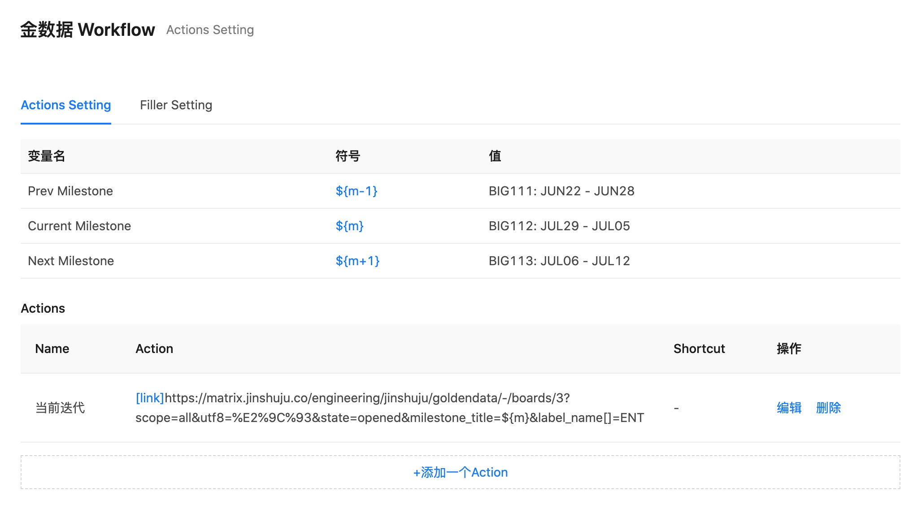

# CHROME EXTENSION - GD WORKFLOW

- Actions

- Filler

# SETUP

https://chrome.google.com/webstore/detail/gd-workflow/clapcpmdlclpngcckhadiocafbggilaf

# 隐私保护

感谢您使用我们的产品和服务！我们尊重您对隐私的关注，并感谢您对我们的信任和信心。
以下为隐私政策所包含信息的概述。

## 请求权限

| 权限         |             说明              |
| ------------ | :---------------------------: |
| contextMenus |        创建快捷菜单栏         |
| tabs         |        在新页面中打开         |
| storage      | 数据存储， 初始化一些默认数据 |
| 主机权限     |  http://\*/\*，https://\*/\*  |

## 信息安全

本插件会将用户填写的预设值存储于本地，，不会向任何服务器发送您的数据信息。

- 如何收集

  用户在插件的配置界面，填写一些常用的表单数据。

- 如何使用

  用户访问金数据表单发布页面，右击「Fill This Form」之后，会随机从用户设置的常用表单数据里面随机填写一个值。

- 共享

  不会向其他用户共享数据

## 数据的销毁

本插件在卸载后会销毁用户在本地存储的数据。

## 解释权

本插件解释权归开发者所有。
